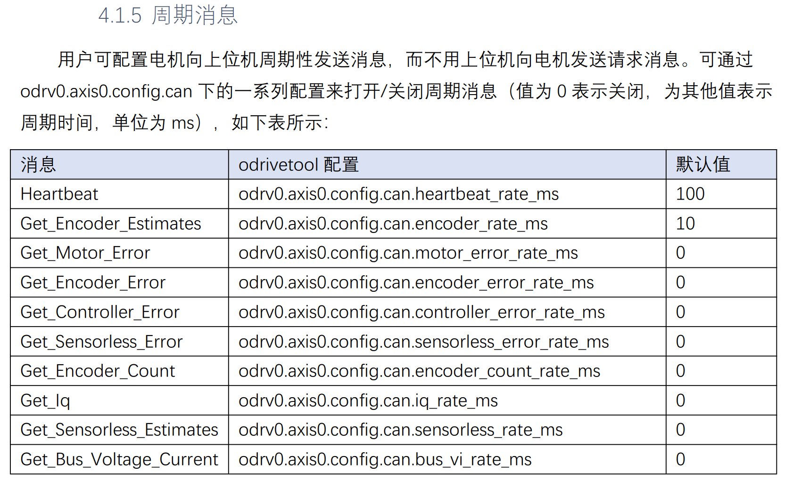

# GIM6010-8_DM02_DoubleFDCAN

## 实现功能

使用DM02开发板（开发板芯片为STM32H723VGT6）控制GIM6010-8电机（伺泰威公司），两路FDCAN控制两个电机，电机电流反馈设置为50Hz，并根据电机设置的扭矩系数，实时估计电机扭矩大小。

## 注意事项

GIM6010-8电机出厂时默认开启心跳以及编码器反馈消息，可以根据手册设置是否使能。这里为了得到电机的扭矩反馈，使能了电流反馈`Get_Iq`，将其乘以扭矩系数后即可估计扭矩大小。

## 参考

STM32H7两路FDCAN配置🔗：[STM32H743+CubeMX-双路FDCAN同时工作的终极方案（裸机）_stm32h743 dsp使用fdcan-CSDN博客](https://blog.csdn.net/wallace89/article/details/119153496)

STM32H7开发🔗：《安富莱_STM32-V7开发板_用户手册，含BSP驱动包设计（V3.5）》

DM02开发板使用🔗：《达妙科技DM-MC-Board02电机开发板使用说明书V1.0》

GIM6010-8电机使用🔗：《SteadyWin GIM6010-8使用手册_rev1.8》
